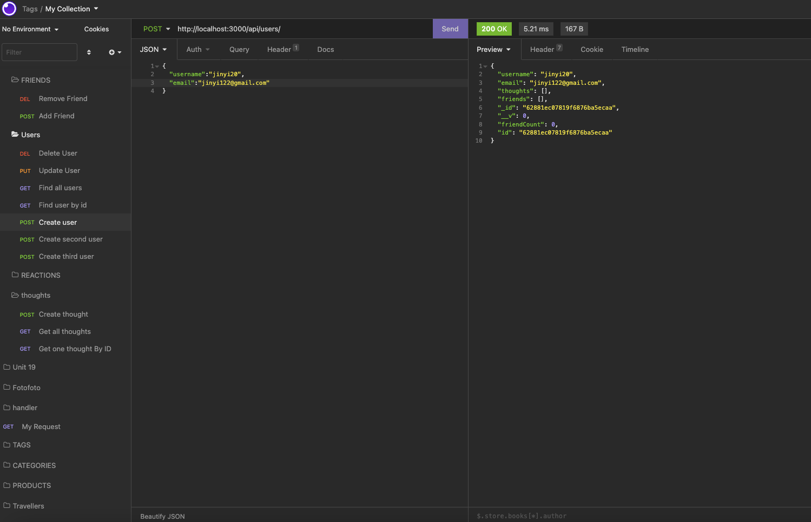
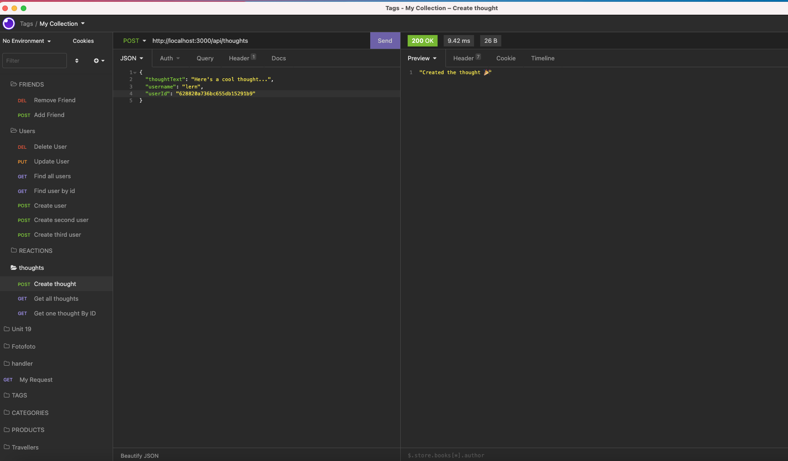

# SocialNetworkAPI

an API for a social network web application where users can share their thoughts, react to friends’ thoughts, and create a friend list.

- Walkthrough video:
-

## Table of Contents

- [Descripttion](#descripttion)
- [Installation](#installation)
- [Mock-Up](#mock-up)
- [Questions](#questions)

---

## Descripttion

The social media startup WANTs an API for its social network that uses a NoSQL database
SO THAT its website can handle large amounts of unstructured data

GIVEN a social network API
WHEN the owner enter the command to invoke the application
THEN its server is started and the Mongoose models are synced to the MongoDB database

WHEN the owner open API GET routes in Insomnia for users and thoughts
THEN the data for each of these routes is displayed in a formatted JSON

WHEN the owner test API POST, PUT, and DELETE routes in Insomnia
THEN the owner is able to successfully create, update, and delete users and thoughts in the database

WHEN the owner test API POST and DELETE routes in Insomnia
THEN the owner is able to successfully create and delete reactions to thoughts and add and remove friends to a user’s friend list

## Installation

Using the [Express.js](https://www.npmjs.com/package/express)for routing

Be sure to have MongoDB installed on your machine. Follow the [MongoDB installation guide on The Full-Stack Blog](https://coding-boot-camp.github.io/full-stack/mongodb/how-to-install-mongodb) to install MongoDB locally.

---

## Mock-Up

The following images show examples of the application's API routes being tested in Insomnia.

The following images shows GET routes to return all users and all thoughts being tested in Insomnia:

The following images show GET routes to return a single user and a single thought being tested in Insomnia:

The following image show the POST, PUT, and DELETE routes for users being tested in Insomnia:

The following image show the POST DELETE routes for thougts being tested in Insomnia:

The following animation shows the POST and DELETE routes for a user’s friend list being tested in Insomnia:

---

## Questions

Feel free to reach out via Github or email with any questions.  
[Github](https://github.com/kayjinyi)  
[email](mailto:kayjinyi@gmail.com)
